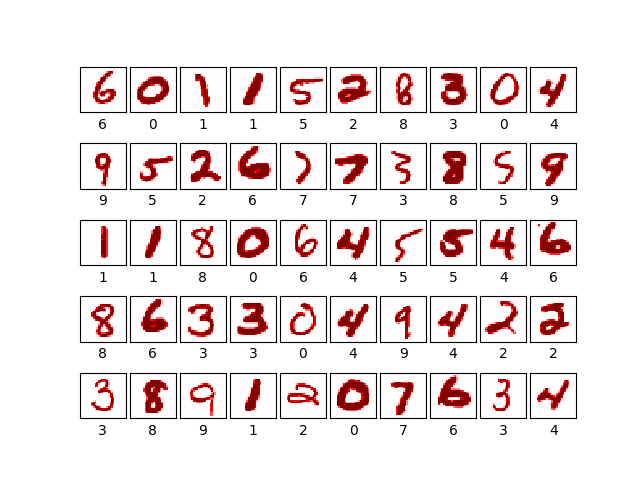
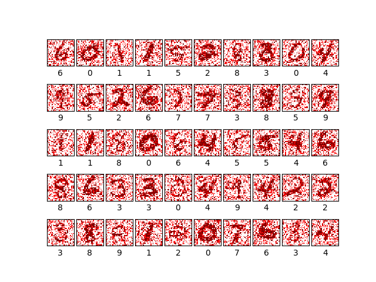

This is a test project. 
Code structure from open source project
https://github.com/nl8590687/ASRT_SpeechRecognition
The purpose is simple, from simple mnist, understand/learn ASRT code structure deeply.
Function include load data/read data/train data
Even add noise in the data. 

1, show pics
show clean pics
python3 ./readdata.py 1000
   

add noise with 
python3 ./readdata.py 1000 1

  

2, train models
python3 ./model.py
or
python3 ./model_noise.py

  np_resource = np.dtype([("resource", np.ubyte, 1)])
Using TensorFlow backend.
Instructions for updating:
Colocations handled automatically by placer.
_________________________________________________________________
Layer (type)                 Output Shape              Param #   
=================================================================
the_input (InputLayer)       (None, 28, 28, 1)         0         
_________________________________________________________________
conv2d_1 (Conv2D)            (None, 28, 28, 32)        288       
_________________________________________________________________
conv2d_2 (Conv2D)            (None, 28, 28, 64)        18496     
_________________________________________________________________
max_pooling2d_1 (MaxPooling2 (None, 14, 14, 64)        0         
_________________________________________________________________
flatten_1 (Flatten)          (None, 12544)             0         
_________________________________________________________________
dense_1 (Dense)              (None, 128)               1605760   
_________________________________________________________________
dense_2 (Dense)              (None, 10)                1290      
_________________________________________________________________
Activation0 (Activation)     (None, 10)                0         
=================================================================
Total params: 1,625,834
Trainable params: 1,625,834
Non-trainable params: 0
_________________________________________________________________
return 0
.............
train= (55000, 784)
train= (55000, 10)
test= (10000, 784)
test= (10000, 10)
[running] train epoch 0 .
[message] epoch 0 . Have train datas 0+
Instructions for updating:
Use tf.cast instead.
Epoch 1/1
 72/500 [===>..........................] - ETA: 1:03 - loss: 0.4604 - acc: 0.8635 

